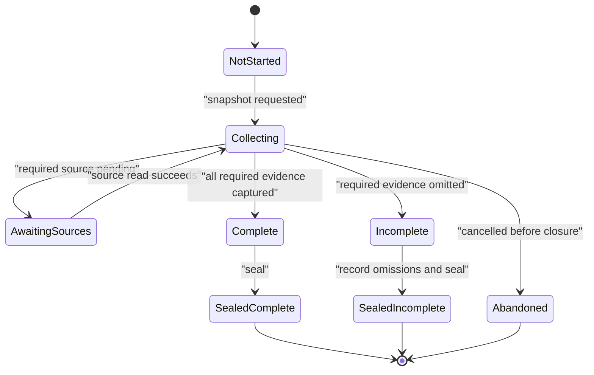
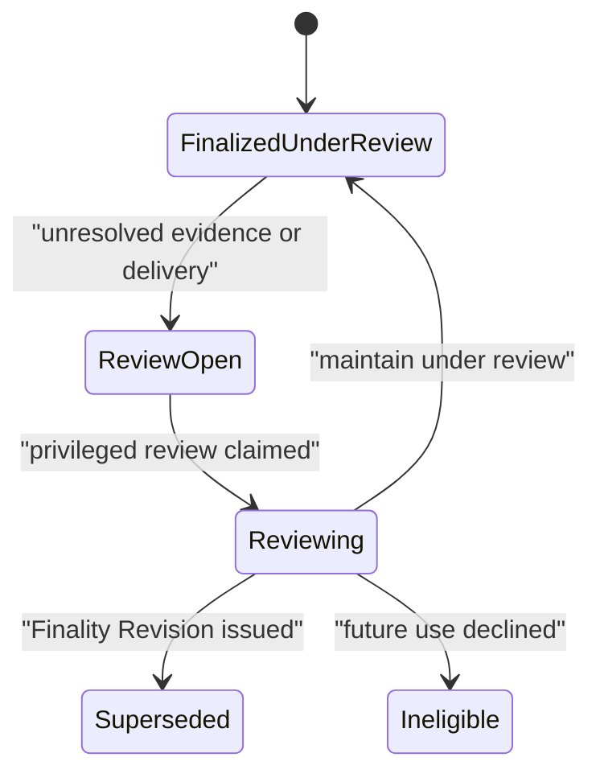

# Govern The SimOps Control Plane And Runtime-Adapter Seam

| Field | Value |
| --- | --- |
| Document ID | ADR-0010 |
| Revision | 1.0 |
| Status | Accepted |
| Owner | Software |
| Baseline | SimOps runtime adapters |

## Status

Accepted

## Context

The SimOps control plane creates, stops, observes, recovers, and records bounded simulation Runs. Its callers need one lifecycle interface while runtime execution can vary between an in-memory contract, Docker, and a Kubernetes Job adapter. The current implementation also assembles per-role `RunConnectionProfile` values that carry only the configuration appropriate to a worker role.

Without an explicit seam, callers can learn runtime-specific configuration, or an adapter can quietly become the owner of run state. Both create a costly tangle: changing the runtime then changes lifecycle policy, recovery semantics, and every caller.

## Decision

The SimOps control plane owns the Run lifecycle, idempotency, worker records, lifecycle recovery, and observable Run outcome. A runtime adapter owns only execution-specific start, stop, and observation behind the `SimopsSpooler` seam; it does not become the authority for the Run record or its domain outcome.

`RunConnectionProfile` is the sole role-scoped configuration input to runtime execution. It is assembled by the control plane and exposes only the worker's needed connection data. Each ordinary Run-Scoped Simulation Worker receives an immutable opaque Worker Ingest Credential bound to its Run and Worker identity through runtime-secret injection; the control plane retains only a server-side verifier, and the worker cannot submit frames for a sibling. The credential has an absolute expiry at the shared Run Deadline, derived once from durable Run acceptance time plus the requested runtime limit; adapter dispatch, first active observation, late observation, and retry cannot extend it. The deadline bounds launch uncertainty as well as observed execution, and expiry is an explicit fence reason. The credential never appears in a Run response, event payload, adapter log, or browser-visible configuration. Each Run persists an immutable Runtime Binding selected at creation; every later execution and reconciliation action uses that binding rather than current process configuration. Docker and Kubernetes are injected adapters, not configuration-selected implementation detail exposed to browser callers. A second adapter may vary execution behaviour, but must preserve the control-plane lifecycle interface and recovery semantics.

The common runtime semantics are a Runtime Stop Request, an Observed Worker Lifecycle, and a Runtime Cleanup Outcome. The control plane records a stop request before asking an adapter to perform the external effect, then reconciles the resulting observation. Stop requests and cleanup outcomes survive gateway restart; Lifecycle Reconciliation is the sole resumption path. A repeated request returns the existing recorded intent; Lifecycle Reconciliation alone retries an external effect after a recorded failure or timeout under a bounded policy, then exposes the unresolved outcome. A Run is stopping while that request awaits worker observation; it is stopped only after the relevant terminal observations are established. Valid authenticated Gateway-Only Worker Ingest remains admitted in `Stopping / AwaitingStopObservation`: a stop request is desired execution state, not credential revocation, and accepted frames are Post-Stop Evidence and active-execution evidence. They never clear `StopUnresolved`, extend stop policy, retract the request, independently complete the Run, or make an artifact eligible. Admission ends on terminal worker observation or under the separate bounded Worker Ingest Admission Policy for `Stopping / StopUnresolved`; that policy cannot outlive the visible unresolved-stop window. An unresolved cleanup outcome does not itself block a later Run; any admission restriction must be an explicit policy. An established worker failure takes precedence over a later stop request when the control plane derives the terminal Run outcome. These are distinct facts: a stop request does not prove terminal execution, and cleanup failure does not rewrite an established terminal worker lifecycle. Each adapter translates its native controls and resource observations into those facts; Docker and Kubernetes need not expose the same low-level sequence.

The authoritative persistence model is a current worker record: desired stop state, Worker Launch Disposition, observed lifecycle, Active Execution Observed, cleanup outcome, and bounded retry metadata. It is deliberately not event sourced at this stage. The control plane may append lifecycle events for notification or audit, but recovery and Run-outcome derivation read the current worker records rather than reconstructing state by replaying those events. Active Execution Observed is a monotonic fact set by either an active runtime observation or a frame admitted through that worker's Worker Ingest Credential, and never cleared. Worker Failure Stage is derived from it as either failed without active observation or failed after active observation; it qualifies the control-plane evidence and does not invent a provider root-cause taxonomy. Observed Worker Lifecycle is likewise monotonic at terminality: after a durable terminal observation, a later nonterminal adapter observation is diagnostic evidence and cannot resurrect the worker. Frame admission and terminal or unresolved-stop fencing serialize against the same durable Run and worker facts in one transaction or equivalent conditional write. Each worker has an Ingest Fence Generation that advances when its admission is fenced and is retained with its accepted frames as admission-order evidence; it is not itself the synchronization mechanism. The same fence transaction clears verifier material and writes a nonsecret Fenced Admission Tombstone containing identity, reason, time, generation, and audit reference; cleanup never restores authority. A terminal worker fences only its own credential and admission state; healthy siblings remain admissible. External broker delivery follows Durable Ingest Admission through a durable outbox or equivalent idempotent delivery path and does not decide authority. Start reconciliation, stop observation, and cleanup use separate bounded Lifecycle Reconciliation Policies; each persists its own attempts, deadline, next eligible time, and latest error because their safety constraints and acceptable delay are materially different. A stop request during uncertain launch first reconciles the stable worker identity, then issues stop only if it finds the worker; it never creates a replacement or treats local cancellation as proof of absence. Unattempted and attempted-absent launch dispositions satisfy that stop request without cleanup; a rejected launch contributes a failed Run only when no stop request supersedes it. If stop observation exhausts without proof of terminal worker observation, the Run remains `stopping` with an unresolved outcome; the control plane must not fabricate either `stopped` or execution `failed`. Adapters report provider effects and facts, but do not select retry policy.

The Control-Plane Admission Clock is PostgreSQL `clock_timestamp()` evaluated inside the serialized Durable Ingest Admission transaction. It alone decides the shared Run deadline credential expiry; worker, Docker, Kubernetes, and process-local gateway clocks remain evidence only.

A Worker Admission Window is half-open: admission is permitted only when that clock is strictly before the shared Run deadline; equality and every later instant are expired and fenced. The predicate belongs in the same locked conditional write that persists admission or fencing, so a transaction delayed behind a fence cannot use its start time to admit a late frame. Post-Stop Evidence is therefore evidence admitted during an open Worker Admission Window, not an entitlement that survives its end.

Run Deadline Reconciliation is a durable scheduled Lifecycle Reconciliation obligation: it finds due Runs independently of reads and worker traffic. For each nonterminal worker it atomically fences still-admissible credentials and records one idempotent Runtime Stop Request with reason `runtime-limit`, then derives `Stopping / DispatchingStop`. If it first finds a worker already terminal, it preserves that observed outcome and records no retroactive stop request. A terminal observation received after the Run Deadline remains a Post-Deadline Runtime Observation: provider observation timing is not proof of post-deadline execution and cannot turn the observed outcome into a synthetic failure. An expired ingest attempt may observe the same admission fence, but it is never required to begin enforcement. The control plane persists the due time and the first reconciliation disposition. Their difference is Deadline Enforcement Lag; if it exceeds the declared enforcement bound, the Run gains that explicit Degradation Reason while reconciliation still issues any required stop request. This bound ends at durable fencing and request recording for a nonterminal worker, not external runtime termination; provider latency and proof of termination remain the separate stop-observation concern. When the Run settles, the lag ceases to be current degradation but remains retained as Resolved Degradation Evidence. Lag never extends the Run Deadline or reopens worker admission. Reconciliation locates stable identity before issuing an external stop for an uncertain launch and settles the Run only from later observation. `runtime-limit` is therefore an internal reconciliation trigger and stop-request reason, not a new public Run Lifecycle, a separate Runtime Limit module, or an adapter-owned deadline policy. The adapter receives only the resulting start, stop, and observation effects.

The SimOps Lifecycle Reconciliation Module is the single seam for start recovery, due-deadline enforcement, stop observation, cleanup, and ObservationTimeliness derivation. Its caller-facing interface is one operation, `ReconcileDueRuns(context) -> ReconciliationReport`; it hides due-run selection, database-clock comparison, fencing, idempotent request recording, bounded retry metadata, lag derivation, provider-time interpretation, and Run projection from callers. The server process schedules that operation but does not decide any SimOps policy. Its deployment-wide deadline-enforcement bound is module configuration, not a Run-request field or runtime-adapter option. It must not reuse the Reactor Telemetry reconciliation interval: that would make SimOps deadline safety contingent on an unrelated module and configuration.

Result Finality is a deep internal module of SimOps Lifecycle Reconciliation. It derives `AwaitingTerminalOutcome`, `AwaitingMaterialization`, `Withheld`, `Eligible`, `PublicationClaimed`, `Finalized`, `FinalizedUnderReview`, `Superseded`, or `Ineligible` from current worker outcomes, material artifact status, and active evidence conditions. Artifact `committed` means materialized and inspectable, not authorized for consumption. An active Terminal Observation Conflict may move materialized output to Withheld without undoing its material commitment, execution outcome, or cleanup. Only Eligible output may enter a recoverable publication claim and atomically emit a durable idempotent Finality Grant with its immutable Grant Recipient Snapshot of stable grantee identities. Artifact Forge and other consumers receive that grant; they do not repeat lifecycle, artifact, or evidence checks. Later role, subscription, endpoint, or configuration changes cannot alter the correction obligations attached to that published snapshot. The snapshot stores stable identity, not a frozen endpoint; Finality Correction Delivery resolves the grantee's current endpoint at each attempt, and failed identity resolution is an explicit delivery failure. A conflict found after grant publication moves Result Finality to FinalizedUnderReview. The grant remains immutable because prior consumption cannot be erased; the control plane instead emits a durable idempotent Finality Correction Notice to every named grantee, leaving each recipient's remediation policy explicit. When relevant, a recipient's notice identifies only that recipient's unresolved Presented Consumption Authorization and exposure facts, never another recipient's authorization or outcome data, and does not assert cancellation. Finality Correction Delivery is its separate bounded lifecycle: NotRequired, Pending, Claimed, RetryScheduled, Delivered, or Unresolved. Claimed is a recoverable lease; Unresolved ends automatic delivery and holds Result Finality under review. It returns to Pending only through a Correction Rearm by an authenticated control-plane operator using the same notice identity, never merely because another reconciliation pass occurs. A grantee may acknowledge or remediate only within its own downstream model; SimOps may retain that response as an audit reference but it does not prove correction delivery, resolve evidence, rearm delivery, or change Result Finality. A Runtime Adapter may provide evidence but may not choose delivery policy. Only resolved evidence plus Delivered notices permits return to Finalized.

Finality Review is a separate privileged control-plane decision mechanism for Result Finality that remains under review. It may maintain that state when evidence is insufficient, supersede it by issuing a new immutable Finality Revision and successor Finality Grant for corrected or requalified material, or declare future consumption Ineligible. Ineligible forbids future use of the current result material but does not make the lineage unrevisable: later evidence may support an explicitly opened review and corrected revision; nothing reopens automatically. Supersede atomically consumes any required Review Approval, records the immutable decision, creates the revision and successor grant, and updates Result Finality. It uses the versioned Result Finality Policy selected when review opens; that policy version remains governing until the review is decided or abandoned, even if a newer policy becomes active, and is retained on the immutable decision. A Result Finality has at most one open review. A durable, time-bounded Reviewer Claim grants an authorized operator exclusive temporary decision authority; expiry returns the review to Open without deciding, abandoning, or changing it. That review may be abandoned and replaced under a newer policy or later snapshot; abandonment is immutable, actor-attributed, and reasoned, and does not alter Result Finality. Its internal Disposition Admissibility module derives Admissible, Requires Explicit Justification, or Prohibited from the cited snapshot and proposed disposition. A material omission can require a decision-local explanation for Supersede or Ineligible; inability to identify the subject, prior grant, or successor material is always Prohibited. It may update only the current Result Finality projection; historical grants, their Grant Recipient Snapshots, correction notices, delivery outcomes, and established worker lifecycle remain immutable evidence. An Unreachable grantee is never reclassified as Delivered.

Finality Lineage is a deep internal module with the interface `ResolveCurrentFinality(subject) -> ConsumptionAuthorization | NoConsumableFinality`. It hides predecessor traversal, uniqueness, supersession atomicity, historical audit, and short-lived authorization issuance. It is an immutable singly linked chain: each Finality Revision references both its one predecessor grant and predecessor result material; each grant or material has zero or one direct successor; and the module derives at most one current lineage head. A Supersede atomically appends its successor and advances the head. Competing candidates are inputs to one Finality Review, never public branches that consumers must choose between. For each new governed use, a consumer resolves the lineage and uses only its short-lived, integrity-protected Consumption Authorization, bound to that consumer, current grant, result material, use scope, and mandatory caller-supplied idempotency key. On presentation, the module atomically re-checks that the authorization's grant remains the current consumable head and marks the authorization Presented; this is the linearization point. A later revision blocks a new use but does not retroactively interrupt the already presented bounded use; the predecessor grant's correction obligations remain visible. It also blocks every later retry under that authorization, even with the same idempotency key; a fresh attempt must resolve current Finality Lineage. Each authorization has a bounded outcome-reporting window; expiry without a report retains Presented as unresolved evidence and does not infer success or failure. Only the canonical consumer bound to the authorization may submit its outcome reference; a mismatched identity is rejected. The first accepted outcome reference is immutable; any later report is separately retained contradictory evidence, never an overwrite. A report after the window is retained as explicitly late evidence but leaves Presented unresolved. Its record and outcome reference are retained at least through the corresponding Finality Lineage and correction-obligation retention period. An unresolved Presented authorization is consumption observability, not automatic Result Finality or Run Operational Condition degradation. Contradictory or late outcome evidence is available to review policy and operators but never opens Finality Review automatically. Historical grants remain immutable audit evidence rather than ongoing authorization. Resolution failure is `NoConsumableFinality`; cached historical grants may not be used as fallback. A reported consumer outcome reference is actor-attributed evidence, not proof of an external real-world side effect.

Review Attention is the separate deep operational module for recipient-scoped downstream exposure anomalies. Its interface is `RecordReviewAttention(exposureEvidence) -> AttentionReceipt` and `ResolveReviewAttention(attentionId, resolution) -> AttentionReceipt`; it hides evidence relevance, canonical recipient identity, correlation to authorization and lineage, deduplication, claims, deadline enforcement, escalation, and audit history. It creates at most one active attention for the same recipient, Consumption Authorization, and evidence kind. Stronger exposure evidence creates a new linked attention and marks the prior attention Superseded, preserving the evidence timeline while keeping one active attention. Its states are Detected, Open, Claimed, ResolvedNoReview, EscalatedToReview, and Superseded; claim expiry safely returns Claimed to Open. It has a policy-defined resolution deadline. An open attention adopts the newest escalation policy immediately. Missing that deadline escalates recipient-scoped operator urgency only: it does not alter Result Finality or Run Operational Condition and does not open Finality Review. An operationally authorized actor may resolve an attention with immutable actor-attributed rationale and cited evidence references. EscalatedToReview records an explicitly opened review identity without presuming its outcome; opening Finality Review remains governed by its separate privileged authority policy.

Review Authorization is Finality Review's internal authority module. Its interface is `AuthorizeFinalityReview(action, review, actor) -> AuthorizationResult`; callers do not interpret roles, canonical identity, lease validity, policy version, or separation-of-duties rules. The policy can permit a single operator or require dual control. Under dual control for irreversible decisions, an actor deciding Supersede or Ineligible must differ from both the actor who opened the review and its current Reviewer Claim holder and must hold a distinct durable Review Approval of the cited evidence. That approval is bound to the exact evidence set, governing policy version, and proposed disposition; a change to any of those facts requires a new approval. It expires after the period defined by that policy, requiring fresh assessment without rewriting its history. The decision retains its authorization basis immutably.

Closed Evidence Snapshot is the deep module that supplies Finality Review's named, immutable evidence set. Its interface is `CloseEvidenceSet(subject, scopeVersion) -> SnapshotClosure`; callers do not enumerate terminal records, conflict episodes, verification attempts, correction-delivery outcomes, artifact and grant references, or Consumption Authorizations and their outcome references tied to the grant or result under review. The latter form exposure context, not automatic correctness conclusions. The implementation owns source enumeration, watermarking, retries, omission classification, normalized stable references, integrity recording, and idempotency. SnapshotCompleteness is its internal closure state machine: `NotStarted`, `Collecting`, and `AwaitingSources` are assembly-only; `Complete` and `Incomplete` are ready-to-seal; only `SealedComplete` or `SealedIncomplete` may be cited by a review. Every sealed incomplete snapshot retains each required omission with its reason and retryability. Either sealed state may support any privileged Finality Review decision: Maintain Under Review, Supersede, or Ineligible. For a sealed incomplete snapshot, the immutable decision classifies every omission as Material or Nonmaterial and retains a rationale. The decision retains the cited snapshot and its omissions; it does not make uncertainty disappear. A sealed snapshot cannot be upgraded, downgraded, or amended by later evidence; that evidence instead supports a new snapshot at a later watermark.

```mermaid
stateDiagram-v2
    [*] --> AwaitingTerminalOutcome
    AwaitingTerminalOutcome --> Ineligible: "terminal failure or stopped"
    AwaitingTerminalOutcome --> AwaitingMaterialization: "successful terminal outcome"
    AwaitingMaterialization --> Ineligible: "materialization fails"
    AwaitingMaterialization --> Withheld: "materialized with active conflict"
    AwaitingMaterialization --> Eligible: "materialized with clear evidence"
    Withheld --> Eligible: "conflict resolved or dispositioned"
    Eligible --> Withheld: "new active conflict"
    Eligible --> PublicationClaimed: "durable claim"
    PublicationClaimed --> Eligible: "claim expires or publication fails"
    PublicationClaimed --> Finalized: "Finality Grant published"
    Finalized --> FinalizedUnderReview: "new active evidence conflict"
    FinalizedUnderReview --> Finalized: "conflict resolves; every notice delivered"
    FinalizedUnderReview --> FinalizedUnderReview: "notice delivery unresolved"
```

```mermaid
stateDiagram-v2
    [*] --> NotRequired
    NotRequired --> Pending: "correction notice required"
    Pending --> Claimed: "due and durably claimed"
    Claimed --> Delivered: "idempotent receipt recorded"
    Claimed --> RetryScheduled: "delivery failure; budget remains"
    Claimed --> Pending: "claim expires after interruption"
    RetryScheduled --> Pending: "next eligible time"
    Claimed --> Unresolved: "automatic policy exhausted"
    RetryScheduled --> Unresolved: "automatic policy exhausted"
    Unresolved --> Pending: "explicit privileged rearm; same identity"
```

The runtime-adapter seam normalizes `AdapterObservationTime` and optional `ProviderTerminalTime`; Lifecycle Reconciliation separately assigns `ControlPlaneRecordedTime` when it durably records the fact. In the Postgres-backed control plane, it uses PostgreSQL `clock_timestamp()` in that same transaction; in-memory tests inject an equivalent clock. An adapter supplies Provider Terminal Time only when it can attribute one unambiguous time to the stable worker identity: Docker may supply its container finished time; Kubernetes prefers the Job's own terminal time and omits the field rather than selecting among multiple Pod times; the contract adapter may omit it. Adapter and provider times are portable diagnostic evidence only. Runtime Observation is strictly read-only and may be retried by Terminal Observation Conflict verification without starting, stopping, deleting, or otherwise mutating a runtime resource; Runtime Cleanup is the separate explicit effect under its own policy. Lifecycle Reconciliation may use the evidence to derive ObservationTimeliness, but only Control-Plane Recorded Time orders durable state transitions; no adapter-supplied time decides Worker Admission, fences, Runtime Stop Requests, retries, or the terminal Run outcome. This preserves a small adapter interface while keeping all timestamp policy local to the control plane.

Terminal Observation Conflict is a nested worker-local evidence model within SimOps Lifecycle Reconciliation. The first durable terminal observation remains the authoritative worker outcome: later nonterminal reports are nonterminal regressions and different terminal reports are terminal disagreements, neither of which may resurrect or rewrite the worker. A matching later terminal observation is corroboration. Resource absence is an observation gap, not corroboration. Conflict Status is `NotApplicable` before terminality, then `Clear`, `Queued`, `Verifying`, `Unresolved`, or `Resolved`. Queued, Verifying, and Unresolved are active Degradation Reasons; Resolved retains Resolved Degradation Evidence. A separate bounded Terminal Observation Conflict Reconciliation Policy owns verification and never borrows the start, deadline, stop-observation, or cleanup budgets. Cleanup is held while the conflict is Queued or Verifying to preserve corroboration evidence, and is eligible while Clear, Resolved, or Unresolved. A transition to Resolved or Unresolved atomically records cleanup eligibility before any separately claimed cleanup attempt begins; cleanup and later resource absence cannot resolve the conflict.

```mermaid
stateDiagram-v2
    [*] --> NotApplicable
    NotApplicable --> Clear: "first durable terminal observation"

    Clear --> Queued: "conflicting observation persists"
    Queued --> Verifying: "conflict policy claims verification"
    Verifying --> Queued: "inconclusive; attempts remain"
    Queued --> Unresolved: "policy expires"
    Verifying --> Unresolved: "policy expires"
    Verifying --> Resolved: "established terminal corroborated"
    Unresolved --> Resolved: "later corroboration arrives"
    Resolved --> Queued: "new contradiction; new episode"

    note right of Clear
      Same terminal observation corroborates.
      Nonterminal regression or different terminal
      opens a conflict. Absence does not resolve it.
    end note
```

Verification Status is the private, policy-scoped module within Terminal Observation Conflict Reconciliation. It is `NotRequired`, `Pending`, `Claimed`, `RetryScheduled`, `Corroborated`, or `Exhausted`. `Claimed` is a durable, time-limited Verification Claim; it means that a reconciler may attempt an observation, never that the observation completed. Claim expiry returns the episode to Pending after a crash or abandoned attempt. Adapter error, timeout, resource absence, or any nonmatching observation is inconclusive and schedules a bounded retry or eventual Exhausted status. Only an adapter observation matching the established terminal outcome reaches Corroborated. A later contradiction after Corroborated starts a new verification episode. Internally, Pending and RetryScheduled project to conflict `Queued`, Claimed projects to `Verifying`, Exhausted to `Unresolved`, and Corroborated to `Resolved`.

```mermaid
stateDiagram-v2
    [*] --> NotRequired
    NotRequired --> Pending: "Terminal Observation Conflict opens"
    Pending --> Claimed: "due and durably claimed"
    Claimed --> RetryScheduled: "inconclusive; retries remain"
    RetryScheduled --> Pending: "next eligible time arrives"
    Claimed --> Corroborated: "established terminal observed"
    Claimed --> Exhausted: "policy budget exhausted"
    RetryScheduled --> Exhausted: "policy deadline expires"
    Claimed --> Pending: "claim expires after interruption"
    Exhausted --> Corroborated: "later corroboration arrives"
    Corroborated --> Pending: "new contradiction; new episode"
```

An observed missing or image-pull-failed worker is initially uncertain rather than terminal. Lifecycle Reconciliation observes the Runtime Binding until it either establishes a terminal worker lifecycle or exhausts the bounded policy; only the unresolved result contributes a missing-worker failure to the derived Run lifecycle.

Degraded is an Operational Condition rather than an execution lifecycle. It is not an implicit cancellation: other workers continue through Gateway-Only Worker Ingest unless an explicit Runtime Stop Request or a separately declared admission or safety policy stops them.

The control plane may retain an in-memory contract adapter for deterministic local tests. It must not infer a production runtime from a browser request or allow the browser to select images, credentials, worker counts, or cleanup policy.

The contract adapter must model the same stable runtime facts as Docker and Kubernetes, including observation loss, stop timeout, cleanup failure, and deletion races. It does not reproduce their container or Job mechanics. A multi-worker operation returns one stable outcome for every requested profile, including an explicit unknown result; the control-plane implementation compensates only confirmed launches and reconciles unknown results. For an unknown start, Lifecycle Reconciliation first locates the external resource using the deterministic Run and worker identity; it starts again only after absence is proved. A SimOps Run reconciles only through the adapter selected at creation; container-provider migration is not supported and requires a new Run.

The control plane models runtime lifecycle as a derived hierarchical state machine, not one overloaded status. Its Run projection has three orthogonal regions: an exclusive Run Lifecycle with one nested Run Phase, an Operational Condition with explicit Degradation Reasons, and a Run Cleanup Aggregate. Desired stop, observed execution, cleanup, and retry records remain the authoritative worker facts. `NotLaunched` is a worker outcome, not a Run Phase. A Run becomes `Stopped / StopSettled` only when every planned worker is observed stopped or proved not launched and none has an established failure. If all workers are proved not launched, the Cleanup Aggregate is `NotApplicable`: no resource was proved to exist, so it is not a successful cleanup claim. Cleanup may start only after a terminal worker observation, including a policy-exhausted `missing` result. In that case it reconciles the stable runtime identity for a possible orphan; only observed removal or idempotent absence establishes cleanup success. It cannot act as an implicit force-stop for an active or unresolved worker.

```mermaid
stateDiagram-v2
    direction LR

    state "Run projection" as Run {
        state "Lifecycle region" as Lifecycle {
            [*] --> Starting
            state Starting {
                [*] --> Planned
                Planned --> Dispatching
                Dispatching --> AwaitingLaunchObservation
            }
            Starting --> Streaming: launch evidence permits execution
            Starting --> Stopping: stop request

            state Streaming {
                [*] --> Executing
                Executing --> AwaitingWorkerTerminality
            }
            Streaming --> Stopping: stop request
            Streaming --> Complete: all planned workers succeeded
            Streaming --> Failed: terminal failure derivation

            state Stopping {
                [*] --> DispatchingStop
                DispatchingStop --> AwaitingStopObservation
                AwaitingStopObservation --> StopUnresolved: policy exhausted
            }
            Stopping --> Stopped: all workers stopped or not launched; phase StopSettled
            Stopping --> Failed: terminal failure outranks later stop
        }

        --
        state "Operational-condition region" as Condition {
            [*] --> Healthy
            Healthy --> Degraded: unresolved obligation or uncertain evidence
            Degraded --> Healthy: all reasons clear within policy
        }

        --
        state "Cleanup region" as Cleanup {
            [*] --> NotApplicable
            NotApplicable --> Pending: terminal worker has resource or possible orphan
            Pending --> Complete: all eligible cleanup proven
            Pending --> Unresolved: cleanup policy exhausted
            Unresolved --> Complete: later reconciliation proves removal
        }
    }
```

## Consequences

Runtime work becomes replaceable at one seam while Run lifecycle meaning remains local to the control plane. The cost is that adapters must translate observations into the stable lifecycle model and cannot introduce their own hidden state machine. The active contracts are recorded in [SimOps Runtime Adapters](../design/simops-runtime-adapters.md) and the `RunConnectionProfile` implementation.
