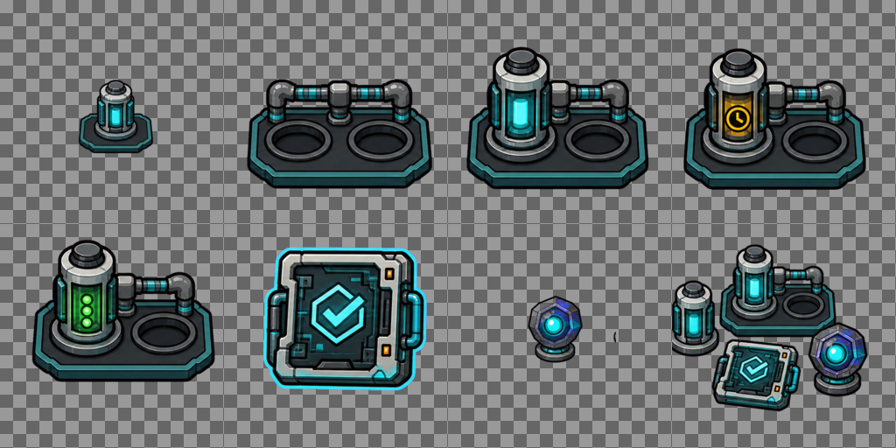

# Fleet Board Asset Checklist

| Field | Value |
| --- | --- |
| Document ID | FLEET-BOARD-ASSETS-001 |
| Revision | 0.2 |
| Status | V2 simulation pack delivered; remaining asset backlog open |
| Owner | Software |
| Scope | Fleet Board placeholder and finished asset tracking |

## Placeholder Pack

- [x] Cheap placeholder sprite sheet generated for early board feel.
  - Placeholder path: `src/assets/fleet-board/fleet-board-placeholder-sprites.png`
  - Generated source: `/Users/nathanwhite/.codex/generated_images/019f451f-bc35-7e81-aa17-3c15d833827c/ig_0c1eefbee1ec22c3016a4f5f72af4081969466f796280459e7.png`
  - Prompt note: hybrid tabletop schematic, 4x2 grid, eight square sprites, no labels or logos.
  - Approval state: prototype only, not finished art.

## Finished Asset Checklist

| Status | Asset | Size | Priority | Prompt Notes | Placeholder | Finished Path | Approval |
| --- | --- | --- | --- | --- | --- | --- | --- |
| [ ] | Reactor facility card | 256x256 PNG/WebP | High | Industrial tabletop card, abstract micro-reactor, no safety controls, no text. | `fleet-board-placeholder-sprites.png` cell 1 | TBD | Pending |
| [ ] | TRISO supply card | 256x256 PNG/WebP | High | Abstract fuel block supply/fabrication tile, no enrichment/process detail. | `fleet-board-placeholder-sprites.png` cell 2 | TBD | Pending |
| [ ] | Desalination plant card | 256x256 PNG/WebP | High | Water service tile with process lines, tank silhouettes, no text. | `fleet-board-placeholder-sprites.png` cell 3 | TBD | Pending |
| [ ] | Base load/customer card | 256x256 PNG/WebP | High | Resilience/base customer tile, muted facility icon, no marks. | `fleet-board-placeholder-sprites.png` cell 4 | TBD | Pending |
| [ ] | Battery/grid sink card | 256x256 PNG/WebP | Medium | Energy sink tile with battery/grid motif, cyan route ports. | `fleet-board-placeholder-sprites.png` cell 5 | TBD | Pending |
| [ ] | Inspector pawn | 128x128 PNG/WebP | High | Friendly review pawn, clipboard/visor motif, not law enforcement. | `fleet-board-placeholder-sprites.png` cell 6 | TBD | Pending |
| [ ] | Trouble pawn | 128x128 PNG/WebP | High | Dynamic hazard pawn, amber/red warning shape, playful not catastrophic. | `fleet-board-placeholder-sprites.png` cell 7 | TBD | Pending |
| [ ] | Route pulse token | 128x128 PNG/WebP | Medium | Cyan/teal animated-flow token or short strip. | `fleet-board-placeholder-sprites.png` cell 8 | TBD | Pending |
| [ ] | Grid tile background | 512x512 seamless PNG/WebP | Medium | Dark slate industrial board texture with subtle grid. | None | TBD | Pending |
| [ ] | Build palette icons | 64x64 PNG/WebP | Medium | Small icon variants for facility buttons. | Placeholder sheet | TBD | Pending |
| [ ] | Outage/refueling markers | 128x128 PNG/WebP | Medium | Clear board markers, non-alarmist, no SCRAM/emergency language. | None | TBD | Pending |
| [ ] | Service-credit tokens | 96x96 PNG/WebP | Low | Water/resilience/electric/thermal tokens for score feedback. | None | TBD | Pending |
| [x] | Simulation container token | 128x128 PNG | Low | Abstract local-game compute cartridge, no vendor/cloud logos. | None | `simulation-container-token.png` | V2 approved |
| [x] | Reactor Slot Rail states | 256x256 PNG | Low | Empty, idle, queued, and running states with distinct cyan, amber, and green cues. | None | `reactor-slot-rail-{empty,idle,queued,running}.png` | V2 approved |
| [x] | Completed Simulation Job card | 256x256 PNG | Low | Schematic local-game compute tile with geometric completion mark, no shell/terminal text. | None | `simulation-job-completed.png` | V2 approved |
| [x] | Insight Token | 128x128 PNG | Low | Reactor-scoped violet/cyan analytical reward token; no evidence or safety claim. | None | `insight-token.png` | V2 approved |

## V2 Simulation Pack Provenance and QA

- Stable semantic keys, file paths, dimensions, states, and provenance are recorded in `src/assets/fleet-board/fleet-board-v2-simulation-assets.json`.
- The transparent source atlas is `src/assets/fleet-board/fleet-board-v2-simulation-atlas.png`; the small grouped preview is `src/assets/fleet-board/fleet-board-v2-simulation-pack-preview.png`.
- The generated source came from OpenAI built-in image generation on 2026-07-13 using an eight-cell, hybrid-tabletop-schematic prompt and a flat magenta chroma key. The exact generated source path and removal settings are retained in the manifest.
- `fleet-board-v2-simulation-assets-qa.png` is the visual QA artifact. Its checkerboard proves transparency and its order is: container token, empty rail, idle, queued, running, completed job, Insight Token, board-scale group.
- Run `bun run fleet-board:v2-assets:check` to verify semantic keys, exact dimensions, RGBA output, the atlas, and the QA sheet. This gate is part of `bun run ci`.
- Artifact Forge imagery remains deferred and is not present in this pack.

## Style Rules

- Keep the visual language as hybrid tabletop schematic.
- Avoid real controls, alarms, safety systems, emergency symbols, operating procedures, company marks, labels, and text.
- Finished assets should use consistent sprite framing, palette, outline weight, and route-port placement.
