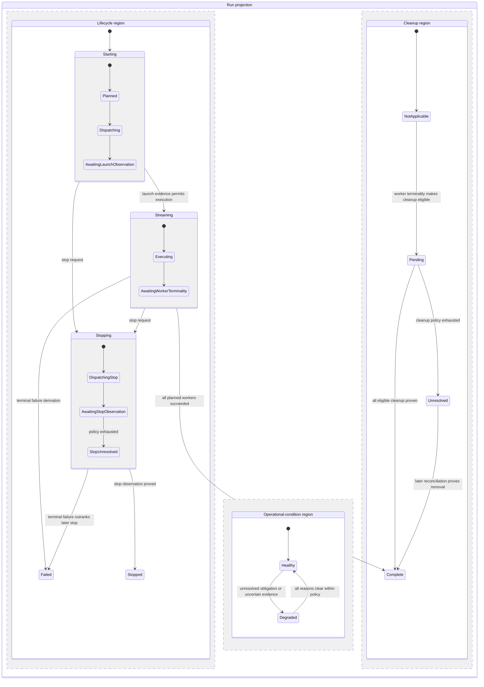

# SimOps Hierarchical State-Machine Research

| Field | Value |
| --- | --- |
| Document ID | SIMOPS-HIERARCHICAL-STATE-MACHINE-RESEARCH-001 |
| Revision | 0.1 |
| Status | Research note |
| Scope | Issue #129 lifecycle model; no runtime or schema change |

## Question

How should a durable control plane represent a long-running Run whose execution
lifecycle, operational condition, and cleanup obligation advance independently
but must be presented coherently after restart?

## Source facts

### Hierarchical state machines distinguish nesting from concurrency

- SCXML defines a compound `state` as a state with children.  While a compound
  state is active, exactly one child is active; entering an atomic descendant
  also enters its ancestors.  Therefore a parent can give a stable public
  meaning while a child records the phase that explains it.
  [W3C SCXML 1.0, compound states and legal configurations](https://www.w3.org/TR/scxml/#LegalStateConfigurations).
- SCXML's `parallel` element is different: all child regions are active when
  the parent is active, and each independently selects a transition for an
  event.  The specification explicitly says this need not mean threads: event
  processing has a defined serial order.  Thus orthogonal regions model
  independent facts, not necessarily concurrent code.
  [W3C SCXML 1.0, parallel states](https://www.w3.org/TR/scxml/#parallel).
- In a legal SCXML configuration, a non-parallel compound state has exactly
  one active child, whereas a parallel state has all child regions active.
  A model should not call dimensions "substates" if several can be true at
  once; they are separate regions.
  [W3C SCXML 1.0, legal state configurations](https://www.w3.org/TR/scxml/#LegalStateConfigurations).
- SCXML transitions are event-triggered and may be conditionalized by guards.
  The transition can run work between exit and entry actions.  This establishes
  the vocabulary of an event, a guard, and a transition, but does not require
  that a durable controller execute state-entry effects synchronously.
  [W3C SCXML 1.0, transitions](https://www.w3.org/TR/scxml/#transition).

### Control planes preserve intent and observation separately

- Kubernetes describes an object `spec` as desired state and `status` as
  current state supplied by the system and its components.  The control plane
  continually attempts to move actual state toward desired state.
  [Kubernetes object spec and status](https://kubernetes.io/docs/concepts/overview/working-with-objects/#object-spec-and-status).
- Kubernetes documents a controller as a non-terminating control loop that
  watches shared state and makes changes attempting to move current state
  toward desired state.  Its kubelet example has distinct reconciliation paths
  for normal, terminating, and terminated Pods.
  [Kubernetes controllers](https://kubernetes.io/docs/concepts/architecture/controller/),
  [Kubelet sync loop](https://kubernetes.io/docs/reference/node/kubelet-sync-loop/).
- Kubernetes' status subresource separates authority: clients write `spec`,
  while a controller writes `status`.  This is a useful authority pattern, not
  a claim that SimOps should become a Kubernetes custom resource.
  [Kubernetes custom resources](https://kubernetes.io/docs/concepts/extend-kubernetes/api-extension/custom-resources/).

### External effects cannot be inferred from a local cancellation

- Go documents `Context` cancellation as a signal that work is no longer
  needed; cancellation is advisory and code decides how to react.  It does not
  itself stop external execution.
  [Go: Cancellation, Context, and Plumbing](https://go.dev/talks/2014/gotham-context.slide).
- Kubernetes similarly separates a deletion request from completion: a
  deletion grace period is recorded while the kubelet and container runtime
  perform the asynchronous stop work.  A force deletion can remove the API
  object without confirmation that the resource has stopped.
  [Kubernetes Pod termination and forced deletion](https://kubernetes.io/docs/concepts/workloads/pods/pod-lifecycle/#pod-termination-flow).

## Repository proposal, not source fact

### The proposed hierarchy

The **Lifecycle Reconciliation module** is one deep module.  Its Interface is
not an SCXML interpreter or three caller-driven workflows.  Callers request
start or stop, reconciliation processes due work, and callers read a Run
projection.  Its Implementation owns the internal hierarchy, guards, effects,
and derivation from durable worker facts.  Runtime Adapters remain at the
execution seam and report provider facts.

This diagram shows three **orthogonal regions** only at the Run-projection
level: each is simultaneously meaningful and none should be encoded by
overloading another region's value.  The indented phases are true nested
substates because exactly one explains its parent lifecycle at a time.

### What `Healthy` means

`Healthy` is not a synonym for idle, successful, or absence of work.  It is
the condition in which every currently applicable control-plane obligation is
within its own bounded policy and there is no contradictory or unresolved
evidence.  Examples:

| Run configuration | Healthy? | Reason |
| --- | --- | --- |
| `Starting / AwaitingLaunchObservation` before its deadline | Yes | Dispatch is in progress, not yet anomalous. |
| `Streaming / Executing` with active workers | Yes | Active execution is normal. |
| `Stopping / AwaitingStopObservation` before its deadline | Yes | A stop request awaits evidence. |
| `Stopping / StopUnresolved` | No | Stop-observation policy has exhausted. |
| `Complete` with cleanup pending inside its policy | Yes | Cleanup remains an obligation but is not yet degraded. |
| terminal execution with cleanup unresolved | No | A visible operational obligation remains. |

`Degraded` needs one or more explicit, current reasons rather than a vague
substate.  Candidate repository reason codes are `launch-unknown`,
`image-pull-uncertain`, `observation-missing`, `stop-unresolved`, and
`cleanup-unresolved`.  They are facts derived from worker observations and
policy records; they are not provider status strings and are not standard
SCXML terms.

### Source facts versus authoritative records

The Runtime Adapter returns source facts: provider observation, confirmed
absence, command acknowledgement, or indeterminate error.  Lifecycle
Reconciliation persists the durable source records needed to interpret those
facts: a Runtime Stop Request, latest observed worker lifecycle with time and
reason, cleanup outcome, and separate start/stop/cleanup policy records.

The following fields are **derived projections**, not competing authorities:

- Run lifecycle and its current nested phase;
- operational condition and its current degradation reasons; and
- the Run cleanup aggregate.

This follows the desired/current-state separation used by Kubernetes while
avoiding a second persisted Run status that could disagree with worker records
after a process restart.  It is also not Event Sourcing: the present worker
facts remain authoritative; compact attempt receipts can supply audit history.

### Guards and priority rules

Guards are predicates over durable worker facts and policy time, evaluated by
Lifecycle Reconciliation.  They must be deterministic for a given stored
record and `now`.

| Event or reconciliation finding | Guard | Result |
| --- | --- | --- |
| `StopRequested` during launch uncertainty | execution not terminal | Enter `Stopping`; reconcile stable identity first, then issue stop only if the worker is found. Do not create a replacement. |
| `StopRequested` after launch evidence | execution not terminal | Enter `Stopping / DispatchingStop`; retain the stop request. |
| Settled stop after launch uncertainty | every planned worker is observed stopped or proved not launched, and none has an established failure | Enter `Stopped / StopSettled`; proven absence is not inferred from local cancellation or timeout. |
| Fully not-launched Run | no worker was proved to exist | Keep `Cleanup / NotApplicable`; do not report successful cleanup. |
| Stop during launch | worker is unattempted or attempted-absent | Satisfy the worker stop obligation without cleanup. |
| Rejected launch without stop request | provider unambiguously rejected launch | Contribute a failed Run. |
| Failed launched worker | active execution was or was not observed before failure | Retain source facts and derive failure-after-active-observation or failure-without-active-observation; do not invent a provider root-cause taxonomy. |
| Terminal worker failure | all planned workers terminal; at least one failed or policy-exhausted missing | Enter `Failed`, including from `Stopping`. |
| Successful worker observations | all planned workers succeeded | Enter `Complete`. |
| Effect deadline reached | relevant policy is exhausted without proving its target fact | Keep lifecycle phase where unresolved (`StopUnresolved` for stop); add the matching degradation reason. |
| Valid worker-bound credential ingest | `Stopping / AwaitingStopObservation` | Use Durable Ingest Admission to accept the frame under that worker's Ingest Fence Generation as Post-Stop Evidence and set active-execution evidence; retain the stop request without extending or clearing its policy. The frame cannot independently complete the Run or make an artifact eligible. |
| Terminal worker observation, credential expiry by the Control-Plane Admission Clock, or explicit unresolved-stop ingest fence | worker admission is currently open | Atomically fence the worker, advance its generation, clear verifier material, and write a nonsecret Fenced Admission Tombstone. |
| Valid worker-bound credential ingest | terminal worker observation or explicit unresolved-stop ingest fence | Reject the frame; the separate ingest-admission policy cannot outlive visible unresolved stop. |
| Cleanup eligibility | terminal worker has a known resource or a possible orphan, including policy-exhausted `missing` | Enter cleanup `Pending`; a proved `NotLaunched` worker remains not applicable. Do not alter execution lifecycle. |

The failure rule deliberately has priority over a later `Stopped` derivation:
a stop request cannot erase an already established execution failure.  No
transition treats an adapter acknowledgement, a canceled local context, or
cleanup success as proof of a terminal execution result.

## Pattern analysis

| Lens | Finding |
| --- | --- |
| Conceptual model | A durable controller owns three concurrent facts for one Run: progress toward an execution outcome, current operational confidence, and external-resource cleanup. |
| Algorithm / flow | Persist intent and attempt metadata; observe by Runtime Binding and stable worker identity; update worker facts; derive the three projected regions; schedule only eligible next effects. |
| Data structures | A Run owns a collection of worker records. Each worker has desired stop, launch disposition, observed execution, monotonic active-execution-observed evidence, cleanup outcome, and separate bounded policy records. The Run projection contains derived lifecycle/phase, condition/reasons, cleanup aggregate, and failure stage when applicable. |
| Pattern candidates | **Hierarchical state machine** fits the parent lifecycle plus exclusive lifecycle phases. **Orthogonal regions** fit lifecycle, condition, and cleanup because they coexist. **Reconciliation loop** fits the durable desired-versus-observed control flow. This is not Event Sourcing, a Saga, or a Circuit Breaker. |
| Design consequence | Keep one deep Lifecycle Reconciliation module. Do not add a public state-machine module for each region or ask adapters to derive Run state. Its small Interface gives callers leverage and keeps transition policy, failure precedence, and recovery locality. |

### Tests at the module Interface

1. A normal, active worker yields `Streaming / Executing / Healthy`, not
   `Degraded`; either active runtime observation or accepted authenticated
   worker telemetry establishes monotonic active-execution evidence.
2. A lost start reply yields `Starting / AwaitingLaunchObservation`; identity
   reconciliation finds the worker before any second start effect.
3. A stop dispatch acknowledgement yields `Stopping / AwaitingStopObservation`
   and remains Healthy until the stop policy expires.
4. Expired stop observation yields `Stopping / StopUnresolved / Degraded` and
   never fabricates `Stopped` or `Failed`.
5. A worker failure observed before a later stop request yields `Failed`; the
   later request cannot produce `Stopped`.
6. Terminal execution with pending cleanup remains execution-terminal and
   Healthy while cleanup is within policy; an exhausted cleanup policy changes
   only condition/cleanup, not execution lifecycle.

## Source set

All external sources are primary W3C, Kubernetes, and Go documentation,
checked 2026-08-01.  The names, hierarchy, precedence rules, and module design
under “Repository proposal” are issue-specific proposals, not guarantees made
by those sources.
