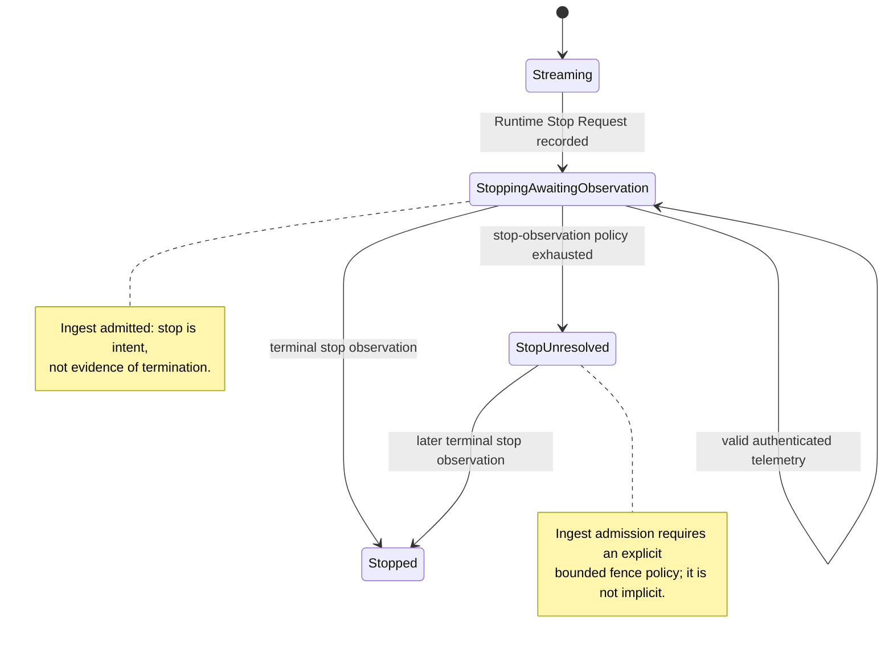

# SimOps stop-window telemetry ingest research

## Question

When a SimOps Run has recorded a stop request but has not yet established a
terminal worker observation, should the gateway keep accepting authenticated,
run-scoped worker telemetry? What do Docker, Kubernetes, and the current
gateway establish about that interval?

## Source facts

### Docker stop is a grace-period request, not an instant execution fact

`docker container stop` sends the container's configured stop signal (normally
`SIGTERM`) to its main process and waits for a timeout before sending
`SIGKILL`. A stop request can therefore overlap with continued application
execution and continued network activity during the grace period.

Source: [Docker: `container stop`](https://docs.docker.com/reference/cli/docker/container/stop/).

The Engine stop endpoint distinguishes a successful request (`204`) from an
already-stopped container (`304`) and a missing container (`404`), but these
are request/lookup outcomes, not a durable control-plane assertion that no
more application messages can arrive.

Source: [Docker Engine API: stop a container](https://docs.docker.com/reference/api/engine/version/v1.45/#tag/Container/operation/ContainerStop).

### Kubernetes termination deliberately permits a shutdown interval

Kubernetes gives a deleting Pod a termination grace period (30 seconds by
default). The kubelet starts graceful shutdown and sends TERM to containers;
only after the grace period does it force remaining processes down. During that
interval Kubernetes removes the Pod from ordinary Service traffic, but its
EndpointSlice treatment is explicit: a terminating endpoint is `ready=false`,
while `serving` exists for consumers that need to know whether it may still be
serving during termination. That is evidence that termination and absence of
all work are different facts.

Sources: [Kubernetes Pod termination flow](https://kubernetes.io/docs/concepts/workloads/pods/pod-lifecycle/#pod-termination-flow), [Kubernetes EndpointSlice conditions](https://kubernetes.io/docs/concepts/services-networking/endpoint-slices/#conditions).

Kubernetes also cautions that force deletion removes the Pod object from the
API server without waiting for kubelet confirmation; the resource may still
run. Thus loss of the provider object cannot safely be used to fence an
already-authenticated worker or to prove it emitted no later data.

Source: [Kubernetes forced Pod termination](https://kubernetes.io/docs/concepts/workloads/pods/pod-lifecycle/#forced-pod-termination).

## Repository facts

- The gateway creates one opaque `IngestToken` for a Run in
  `SimopsController.CreateRun` and validates only that token before accepting
  telemetry. See `backend/slurm-gateway/internal/gateway/simops_controller.go`
  (lines 152-161, 312-351).
- `getRecordForIngest` presently admits only `starting`, `streaming`, and the
  current peer-state `degraded`; it rejects every other lifecycle with HTTP
  409. See `simops_controller.go` (lines 365-374). There is no `stopping`
  lifecycle yet.
- `StopRun` calls the runtime and then immediately writes Run and worker
  lifecycle `stopped`. Consequently it fences ingest immediately, even though
  neither adapter observation nor provider semantics prove execution has
  ended. See `simops_controller.go` (lines 221-254).
- For every accepted telemetry frame, the gateway checks schema, Run ID,
  scenario, worker kind, worker ID, positive sequence, timestamp, and payload;
  it then publishes and increments the stored worker's frame count. See
  `simops_controller.go` (lines 321-351 and 511-537). The same lifecycle/token
  gate also protects `/results` before the Workbench accepts result frames.
  See `simops_handlers.go` (lines 132-168).

## Repository proposal, not a provider guarantee

Admit authenticated, valid telemetry and result frames while the derived Run
projection is `Stopping / AwaitingStopObservation`; stop request is desired
state, not revocation proof. A valid frame during this interval is positive
evidence that execution was observed and should be recorded as such. Admission
ends once the worker's terminal observation is established, or the Run reaches
a terminal lifecycle. A `Stopping / StopUnresolved` Run should not silently
keep accepting indefinitely: it needs an explicit, bounded ingest-admission
policy or an explicit operator action that fences the credential.

This is not an argument for accepting arbitrary late data. The token must
remain run-scoped and opaque; frame validation and worker membership must still
hold. The future Lifecycle Reconciliation module should own the authorization
decision at the same seam as lifecycle derivation, rather than having HTTP
handlers independently infer terminality. If credential compromise or a
strictly bounded telemetry window matters, persist an ingest-fence deadline or
generation and make its expiry an explicit reason for rejecting frames. That
is a control-plane authorization policy, not a Docker or Kubernetes lifecycle
state.

## State-machine consequence

The proposal preserves two independent claims: the control plane asked the
worker to stop, and it later observed authenticated output. It must not let the
latter cancel the former, nor let the former erase the evidence carried by the
latter.
