# SimOps terminal-conflict terminality research

## Question

When a worker has an established terminal outcome, a later runtime observation
contradicts it, and Terminal Observation Conflict reaches `Unresolved`, may
runtime cleanup complete and may the derived Run Lifecycle settle independently
of the active degradation?

## Source facts

### Docker separates inspected terminal state from removal

Docker Engine's container-inspection representation includes current state and
terminal evidence such as `ExitCode`, `StartedAt`, and `FinishedAt`. It is a
description of the container while that resource is inspectable; the inspect
operation returns `404` when the named container does not exist. Separately,
the Engine exposes a container-delete operation, including a `force` option.
Thus, removal makes a later inspection unavailable; it does not change the
meaning of a terminal state already durably recorded by another control plane.

Sources: [Docker Engine API: inspect a container](https://docs.docker.com/reference/api/engine/version/v1.49/#tag/Container/operation/ContainerInspect), [Docker Engine API: delete a container](https://docs.docker.com/reference/api/engine/version/v1.49/#tag/Container/operation/ContainerDelete).

### Kubernetes likewise distinguishes completion from later deletion

Kubernetes documents a Job as terminal when it has either `Complete` or
`Failed`; the API says the two cannot both be true. A completed Job normally
stops creating Pods but keeps its Pods and Job object, specifically so their
status and diagnostic output can be inspected. Deleting the Job deletes the
Pods it created. The TTL controller can later delete a finished Job and its
dependent objects.

Sources: [Kubernetes Jobs: terminal conditions and termination](https://kubernetes.io/docs/concepts/workloads/controllers/job/#job-termination-and-cleanup), [Kubernetes Jobs: automatic cleanup](https://kubernetes.io/docs/concepts/workloads/controllers/job/#clean-up-finished-jobs-automatically), [Kubernetes Job API reference](https://kubernetes.io/docs/reference/kubernetes-api/workload-resources/job-v1/).

The related Pod lifecycle says Pods are ephemeral, that a deleted Pod is
transitioned to `Succeeded` or `Failed` before API-server deletion in normal
cases since Kubernetes 1.27, and that the Pod garbage collector cleans up
terminated Pods. This is further evidence that a provider object's later
absence is not a competing terminal outcome; it is often the ordinary result
of retention policy or cleanup.

Source: [Kubernetes Pod lifecycle](https://kubernetes.io/docs/concepts/workloads/pods/pod-lifecycle/).

## Consequences for the SimOps model

The important distinction is between two different claims:

1. **Established terminal execution outcome** — a durable control-plane fact
   derived from the first accepted terminal runtime observation. It determines
   the worker's contribution to derived `Complete`, `Failed`, or `Stopped`.
2. **Confidence in that outcome** — whether later provider evidence corroborates
   it. A contradictory observation leaves the execution fact monotonic but
   opens Terminal Observation Conflict. `Unresolved` means that bounded
   verification could not remove the contradiction; it does not create a new
   provider terminal result.

Cleanup only acts on the external resource after verification is no longer
`Queued` or `Verifying`. Its successful removal (or idempotent absence) is
evidence of cleanup, not corroboration of terminal execution. After deletion,
the adapter may correctly report absence or be unable to inspect the resource;
that is an **observation gap**, not a terminal regression and not a reason to
rewrite the established outcome.

The converse is equally important: an unresolved conflict must remain active
operational evidence after cleanup. Cleanup intentionally limits future
provider evidence, so it cannot convert uncertainty into confidence.

## Recommendation

Yes: allow the derived Run Lifecycle to settle from the monotonic established
terminal outcomes and independently allow cleanup after the conflict policy
settles at `Resolved` or `Unresolved`. If any conflict is `Unresolved`, the
Run's **Operational Condition remains Degraded** with `Terminal Observation
Conflict` as an active Degradation Reason, even though its Lifecycle is
`Complete`, `Failed`, or `Stopped` and its cleanup aggregate may be complete.

This is not a claim that the provider agrees with the terminal outcome. It is
a precise claim that SimOps has a stable execution result, bounded and exposed
uncertainty about later provider evidence, and a separately completed resource
cleanup obligation. A later matching observation can move the condition to
resolved evidence; a later contradiction begins a new conflict episode without
regressing lifecycle.

```mermaid
stateDiagram-v2
    state "Worker terminal fact" as T {
        [*] --> Established
        Established --> Established: "later nonterminal or different terminal\nopens/advances conflict; fact remains monotonic"
    }

    state "Terminal Observation Conflict" as C {
        [*] --> Queued
        Queued --> Verifying
        Verifying --> Resolved: "matching terminal corroboration"
        Verifying --> Unresolved: "bounded policy exhausted"
    }

    state "Cleanup" as K {
        [*] --> Held: "Queued or Verifying"
        Held --> Eligible: "Resolved or Unresolved"
        Eligible --> Complete: "removed or idempotently absent"
    }

    note right of Unresolved
      Run Lifecycle may settle from Established.
      Operational Condition remains Degraded.
      Cleanup must not resolve this conflict.
    end note
```

## Non-claims

- Provider deletion or a `not found` response does not prove successful
  execution, clean stopping, or corroboration of the terminal result.
- An unresolved conflict does not by itself make a completed execution fail,
  nor does it grant authority to erase its external resource before the
  conflict-verification policy reaches a cleanup-eligible status.
- The cited provider documents describe provider-resource lifecycle; the
  proposed SimOps derivation is a repository policy built on those facts.
