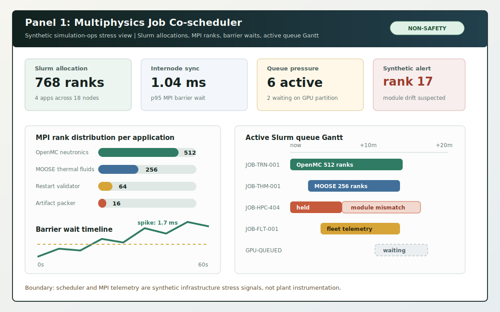
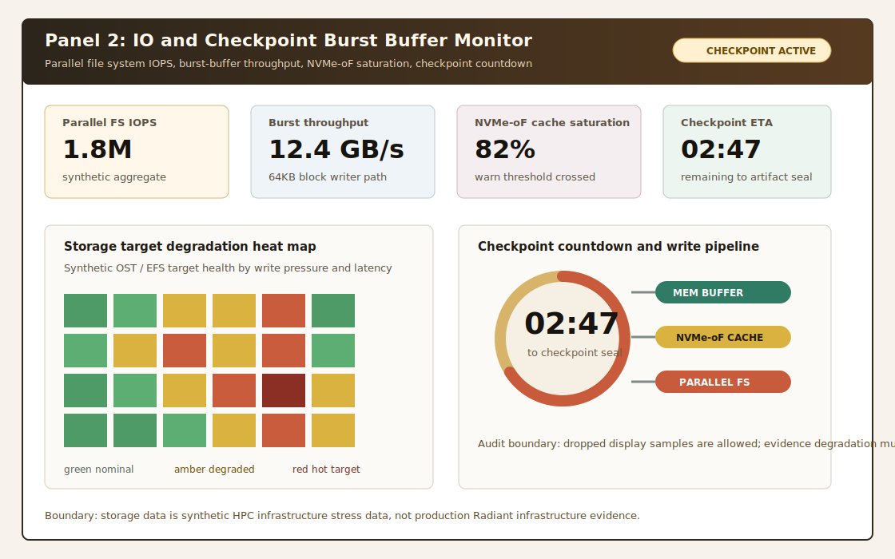
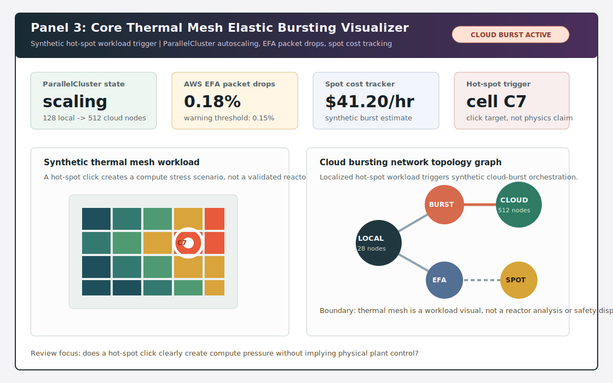
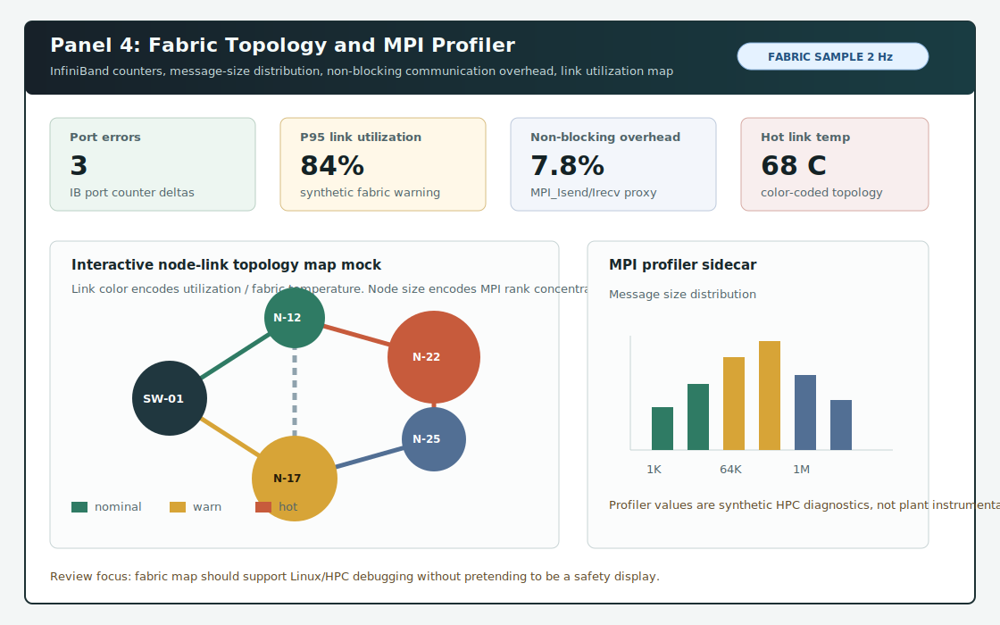

# Simulation Ops Panel Visual Mocks

| Field | Value |
| --- | --- |
| Document ID | SIMOPS-VIS-001 |
| Revision | 0.1 |
| Status | Visual mockup only |
| Owner | Software |
| Baseline | v3.0 planning input |

## Purpose

This document collects visual mockups for the four primary Simulation Ops stress panels inside the Status Workbench HPC status bay. These are static SVG design artifacts only. They do not implement React components, Phaser/WebGL scenes, backend calls, fixture schema, keyboard handlers, or generated evidence.

All panel content is synthetic simulation-operations stress data. These mocks are not a control-room display, plant monitor, safety-path interface, physics trainer, or validated reactor model.

## Panel Mocks

| Panel | Mockup | Role |
| --- | --- | --- |
| Multiphysics Job Co-scheduler | [panel-1-multiphysics-co-scheduler.svg](./simulation-ops-mocks/panel-1-multiphysics-co-scheduler.svg) | Shows Slurm allocation status, MPI rank distribution, internode sync latency, barrier waits, and active queue Gantt. |
| IO and Checkpoint Burst Buffer Monitor | [panel-2-io-checkpoint-burst-buffer.svg](./simulation-ops-mocks/panel-2-io-checkpoint-burst-buffer.svg) | Shows parallel file system IOPS, burst-buffer throughput, NVMe-oF saturation, storage degradation heat map, and checkpoint countdown. |
| Core Thermal Mesh Elastic Bursting Visualizer | [panel-3-core-thermal-elastic-bursting.svg](./simulation-ops-mocks/panel-3-core-thermal-elastic-bursting.svg) | Shows synthetic hot-spot workload trigger, ParallelCluster scaling, EFA packet-drop rate, spot cost, and cloud-burst topology. |
| Fabric Topology and MPI Profiler | [panel-4-fabric-topology-mpi-profiler.svg](./simulation-ops-mocks/panel-4-fabric-topology-mpi-profiler.svg) | Shows InfiniBand counters, message-size distribution, non-blocking communication overhead, and fabric node-link map. |

## Preview

## Integration Notes

- The mocks are designed to appear inside the Status Workbench lower HPC status bay, not as separate top-level products.
- `JOB-HPC-404` is the default scenario anchor for scheduler/module drift.
- `SLURM-GATEWAY-001` is the backend/evidence seam for Slurm submit/status semantics.
- `EP-HPC-404` and deployment checks remain Evidence destinations.
- Diagnostic log and evidence handoff regions can appear below these four panels in the integrated layout.

## Review Questions

1. Do the panels read as a queue-driven lower bay inside Status Workbench?
2. Can a reviewer trace synthetic scheduler, storage, cloud-burst, and fabric warnings to evidence output?
3. Are the non-safety and synthetic-data boundaries visible without verbal explanation?
