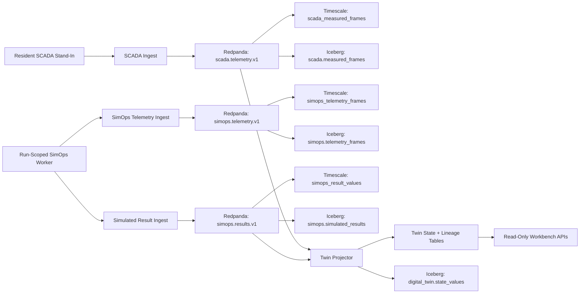
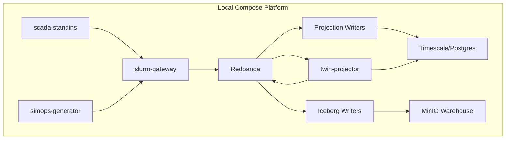

# Simulator Workbench Backend Dataflow Slice

| Field | Value |
| --- | --- |
| Document ID | SWB-DATAFLOW-001 |
| Revision | 0.1 |
| Status | Implemented backend slice |
| Owner | Software |
| Baseline | v3.0 candidate |

## Purpose

This design record controls the backend-only Workbench dataflow slice. The slice proves that one resident measured SCADA unit, one SimOps operational telemetry unit, one synthetic simulated result unit, and one imputed twin value travel through Redpanda, Postgres projections, Iceberg tables, and read-only Workbench APIs.

No frontend controls, visualization wiring, real physics computation, SCADA health panel, or detailed Simulation Health panel is included in this cut.

## Domain Boundary

| Producer | Stream | Value basis rule |
| --- | --- | --- |
| `workers/scada-standins` | `scada.telemetry.v1` | Always `measured` |
| `workers/simops-generator` | `simops.telemetry.v1` | Operational telemetry only; no value basis |
| `workers/simops-generator` | `simops.results.v1` | Always `simulated` |
| `backend/slurm-gateway/cmd/twin-projector` | `digital-twin.state.v1` | May emit `measured`, `simulated`, and `imputed`; only this process emits `imputed` |

## End-To-End Flow

## Service Architecture

## Controlled Interfaces

| Interface | Method | Purpose |
| --- | --- | --- |
| `/internal/scada/sources` | POST | Register public-safe resident source declarations |
| `/internal/scada/telemetry` | POST | Ingest measured SCADA stand-in frames |
| `/internal/simops/runs/{run_id}/ingest` | POST | Ingest operational SimOps telemetry |
| `/internal/simops/runs/{run_id}/results` | POST | Ingest synthetic simulated result frames |
| `/api/simulator-workbench/state` | GET | Read compact Workbench state summary |
| `/api/simulator-workbench/measured` | GET | Read latest measured frames |
| `/api/simulator-workbench/twin` | GET | Read current twin state |
| `/api/simulator-workbench/lineage/{value_id}` | GET | Read selected value lineage |

## Verification

`bun run simulator-workbench:dataflow:smoke` is the objective evidence command for this slice. It starts the local compose platform, sends one bounded SCADA frame batch, launches a `scheduler-drift` run with the `burst-01` worker, and verifies:

- Redpanda topics exist for SCADA telemetry, SimOps telemetry, SimOps results, and twin state.
- Postgres projections contain measured, telemetry, simulated result, imputed twin, and lineage rows.
- Iceberg catalog tables exist for `simops.telemetry_frames`, `scada.measured_frames`, `simops.simulated_results`, and `digital_twin.state_values`.
- MinIO contains Parquet-backed Iceberg data files.
- Read-only Workbench APIs return measured, simulated, imputed, and lineage data.
