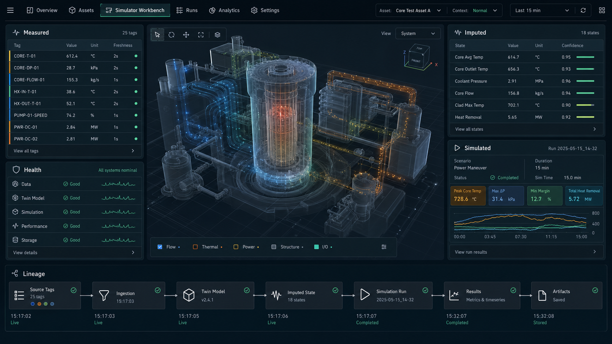

# Simulator Workbench Visual Draft

| Field | Value |
| --- | --- |
| Document ID | SIMWB-VISUAL-001 |
| Revision | 0.1 |
| Status | Concept draft |
| Owner | Software |
| Baseline | Post-v3.0 planning input |

## Purpose

This draft captures a first visual riff for the Simulator Workbench digital twin surface. It is concept-only and does not claim implemented UI, real plant telemetry, control-room behavior, safety behavior, or validated physics.

## Useful Ideas To Keep

- Central twin viewport: a public-safe abstract asset view can anchor the screen without becoming a fake control panel.
- Side panels: measured stand-ins, imputed twin state, and simulated results should use distinct visual treatments and labels.
- Simulation health: run lifecycle, worker state, artifact status, and stream quality belong near simulation results, not in a SCADA maintenance panel.
- Lineage timeline: selected values should show source tags, model steps, run references, and artifacts in one readable strip.
- Density: the first screen should feel like a working engineering tool, not a landing page or marketing hero.

## Guardrails

- Do not add actuation controls, safety-system buttons, alarm-management workflows, SCRAM language, credentials, or infrastructure endpoints.
- Do not use this concept as evidence that a route, component, live stream, or digital twin projector exists.
- Preserve the measured, imputed, and simulated split in the UI before adding visual flair.
